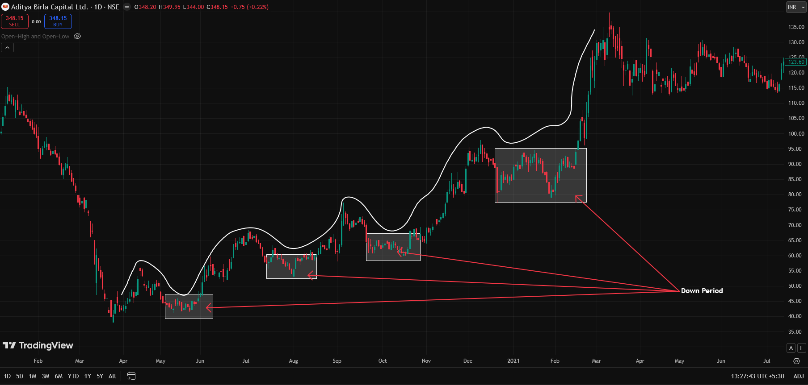
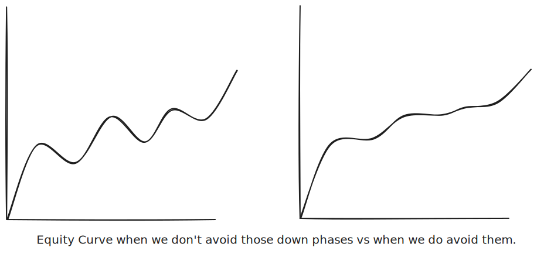
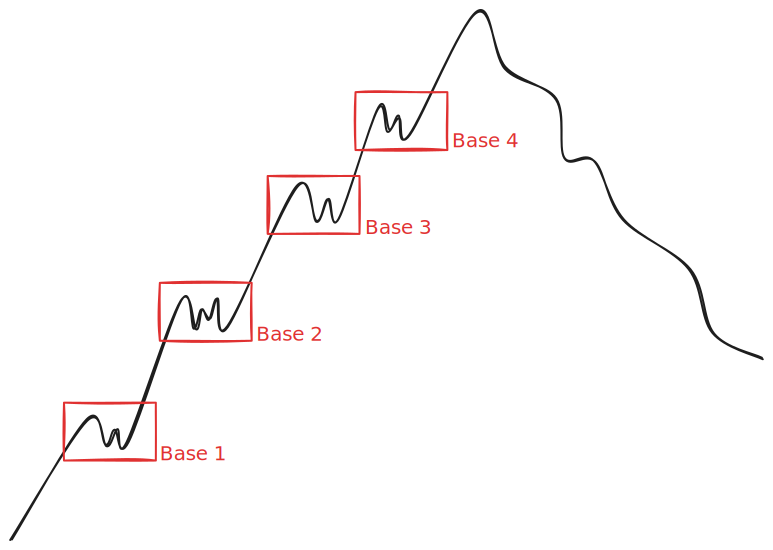

## How Stocks Move
- There is no stock that will give 100% returns straight away; it has to go through some down days where the percentage drops. For example, it might go up 10%, then 8% (-2%), then 15%, then 88%, then 70%, then 90%, then 89%, and finally 100%.
- So only a mature person can sit through these down phases/periods.
- 
- What we need is a system that has a high win rate and less drawdown. So we need a system where we buy and avoid these down phases. If we learn to avoid these phases, then we will have fewer drawdowns. Well, we can't avoid these stages on every trade, but if we do on the majority of them, then the equity curve will be good!
- 
- We need a system that can give you trades more often, even if the magnitude of the move is less. As long as you have trades coming to you every other day, there is a chance that you can grow your small account much faster.

---
---

## Foundations on Which the Market Functions Every Day
- There are certain things that happen in the market every day, no matter what happens outside the market at a macro level, such as interest rate hikes, wars, or COVID.
- So these certain things happen in the market every day, and if we observe these things carefully and just follow them, then you don't need to worry about what is happening around you because the market will continue to behave this way, as they have been doing for 50-60-70 years too.
## 1. Range Expansion and Range Contraction
- In other words, it's nothing but a breakout.
- Range contraction is volatility contraction, which means if a stock was moving 10-20% in a day, it is now tight and only forming or moving in a range of 2-3%.
- These two go together: after expansion, contraction occurs, and after contraction, expansion occurs.
- So these are the only two behaviors that happen in a market, so there is no third behavior out there.
- And these two behaviors happen on any time frame too.
- When range contraction boxes overlap, they give you an even cleaner move.
- If we zoom in too much, then we don't see the pattern there, so zoom out a little.
    #### Task
    - Go through at least 100 stocks to see this on their charts.

## 2. Average % Move in One Go
- The common % move after a dip is 15-20% on a daily time frame.
- So we need a system that works with this 15-20% and not something that is very rare, like 40%+ moves.

## 3. Average Duration Move in One Go
- When a move starts, for how many bars on average is it 3, 5 bars?
- That means if we got 3-5 bars, then the chances are higher of starting a drawdown period.
- Now how can we use this info? For example, suppose a stock is in an uptrend and for 3-4 consecutive days the candles are red. That means there is a higher likelihood of a turnaround, so we can add these stocks to our watch list. So when it reverses, we look for certain signs and we trade.

## 4. Stages Every Stock Goes Through on Every Time Frame
- This same thing happens with bases too, like after 3-4 bases the rally gets over.
    - 
- If we buy after 3 or 4 bases, this is not a young move; it's an old move, so the chances are very low because the move is already exhausted.
- So if you are buying at the third base, then don't expect much from the target.

## Stage 2 End Obvious Signs
- Largest weekly bar since the start on extremely high volume.
- So we sell here, and this is called selling into strength when everyone is buying and you know the signs of the stage ending. You know when the rally is about to end.
- If there is large volume, that can be done only by big institutions, which means the institution is getting out, so our buying can't take the stock higher and make you money.

---
---
- There are only two ways to make money in this market:
    1. You either get few trades in a year and ride it all the way up, but this involves going through down phases.
    2. More trades with less % return, but they are frequent trades.
