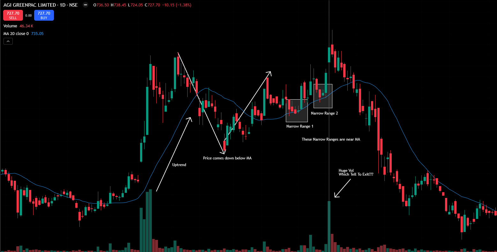

## Agenda
- Continuation Moves
- Reversal moves
- Which one to buy?
- Where to buy?
- How much to buy?
- Where to place stop?
- Trading log

### Trading Setups
Covers the trading setups used and how to select the best opportunities from multiple potential trades. When finding setups among many stocks, determine which one to buy and where to enter the position.

### Stock Selection Process
When narrowing down to multiple potential stocks (example: 10 names for tomorrow), prioritize which one to buy and determine the best entry points among those options.

### Position Sizing
Determine how much to risk per trade. This is critical for proper risk management and account preservation.

### Stop-Loss Placement
Decide where to place protective stops. For example, if deciding on buying GSS tomorrow, determine the appropriate stop-loss level to manage risk.

### Trading Log Importance
For the first six months, 9 out of 10 traders feel they're not making progress, essentially throwing darts in multiple directions. Some trades will hit, but the majority will miss. However, if you log each and every trade and consistently study those trades after six months (or five, depending on effort and market conditions), patterns will emerge and performance will improve.

### Common Trading Log Mistakes
People take trading logs so lightly that if they take a trade on Monday, they might not log it until Sunday - five days later - when they finally have time. Meanwhile, they are very active in finding new setups for the next day, making the trading log an afterthought.

### Consequences of Poor Logging
If you take trading logs lightly, you're wasting those months of experience because without proper data and records, you have nothing substantial to learn from. You will never discover what strategies work best for you and what doesn't.


---
---

# Continuation Moves

### Overview
Continuation moves are the primary trading setups I use, representing the majority of my trades. These setups involve stocks that continue moving in the same direction after a brief correction.

### Key Concept
When a stock is in an uptrend and experiences profit booking, it goes down temporarily but then crosses above its previous high, continuing the original trend. This is the essence of a continuation move.

- 

### Moving Average Analysis
I use the 20-day moving average line to identify trends:
- The 20-day moving average represents the average closing price over the last 20 days
- A rising 20-day MA indicates an uptrend
- This helps distinguish between young and old moves

### Pattern Recognition
**Young vs. Old Moves:**
- Young moves show strong momentum with smaller corrections
- Old moves show exhaustion with larger, more prolonged corrections
- Practice is required to distinguish between them effectively

### Trading Setup Structure

**1. Range Expansion:**
- Stock price falls below the rising 20-day MA
- Represents high volatility and weak hands exiting
- Creates opportunity for new entries

**2. Range Contraction:**
- Price comes back up and moves sideways
- Forms a narrow range or base
- Indicates selling pressure has dried up
- Weak hands have been eliminated

**3. Breakout:**
- Price breaks out of the range
- Continues in the original uptrend direction
- Provides entry opportunity

### Why This Setup Works

**Elimination of Weak Hands:**
- During the correction phase, weak traders (those using margin, loan money, or short-term targets) exit positions
- This reduces future selling pressure
- When the stock resumes its uptrend, there are fewer sellers to stall the move

**Volume and Momentum:**
- Strong buying force is evident in the initial uptrend (e.g., 30% gain in 16 days)
- After correction, the stock shows renewed strength
- Reduced selling allows for cleaner price progression

### Entry Strategy

**Selection Criteria:**
1. Clear uptrend confirmed by rising 20-day MA
2. Price correction below the MA (range expansion)
3. Consolidation near the MA line (range contraction)
4. Narrow range formation indicating weak hands are out

**Entry Point:**
- Look for narrow range formation around the 20-day MA
- Enter when price breaks out of this range
- Typical moves: 15-44% gains in short timeframes

### Common Mistakes to Avoid

**Poor Timing:**
- Don't buy after many consecutive green days
- Avoid entering at the top of extended moves
- This leads to immediate reversals due to profit booking

**Stock Selection:**
- Focus on young moves, not exhausted old moves
- Look for stocks with remaining momentum potential
- Avoid stocks that have already made massive gains

### Practical Application

**Finding Setups:**
- Use scans to identify stocks with rising 20-day MAs
- Look for recent corrections below the MA
- Monitor for range formation and potential breakouts
- Add promising candidates to watchlists for next-day entries

**Risk Management:**
- Position sizing based on account size and volatility
- Stop-loss placement below key support levels
- Focus on 10-15% moves rather than 200-300% gains

### Chart Analysis Points to Remember

**Visual Range Identification:**
- When zoomed in too much, ranges may be difficult to spot
- Use chart compression (scroll out) to identify clear range boundaries
- Look for "box on box, base on base" formations - these are valid consolidation patterns
- The "A to U formation" (price down below 20-day MA, back up, then sideways) is a key setup pattern

**Confirmation Techniques:**
- Use trend angle tools if your eyes aren't trained yet for visual confirmation
- Look for clear support/resistance levels around the 20-day MA
- Confirm range validity by checking if price respects the boundaries multiple times
- Watch for decreasing volatility during range contraction phase

**Weak Hand Elimination Signs:**
- Initial correction drops 15% or more, indicating strong selling pressure
- Subsequent corrections show much smaller drops (3-5%), indicating weak hands are out
- The "towel-drying" analogy: selling pressure gradually diminishes like water from a towel
- Look for 4-5 days of tight consolidation around the 20-day MA

**Enhanced Entry Criteria:**
- Price should consolidate for at least 4-5 days near the 20-day MA
- Range should be relatively narrow compared to previous volatility
- Volume should decrease during consolidation, then increase on breakout
- Breakout should be clean and decisive, not a false move

**Practical Chart Reading Tips:**
- Always check multiple timeframes to confirm the setup
- Use the 20-day MA as both trend indicator and potential support level
- Look for the pattern: uptrend → correction below MA → consolidation → breakout
- Avoid setups where the stock has already made massive gains (focus on young moves)

### Scanning Points
- Creating scans for narrow ranges may cause missing many trading opportunities
- Effective scan criteria: price goes up, then below MA, then comes back up
- For narrow range identification: use candlestick patterns (wick > body) instead of hardcoded percentage ranges
- Create watchlists of potential next-day trading candidates for manual review

### When To Buy - Strong Start Strategy

**Overview**
Most technical analysis suggests buying after breakouts (cup patterns, rectangle patterns), but there are better entry timing strategies using "strong start" concepts.

**Strong Start Definition**
A "strong start" occurs when a stock opens at the same price as its low for the day, indicating immediate buying strength. This typically happens within the first 2-3 minutes after market open at 9:15 AM.

**Key Characteristics:**
- Open price equals low price for the day
- No need to use intraday charts - daily chart analysis is sufficient
- The stock establishes its low immediately after opening
- This indicates strong buying pressure from the start

**Example Analysis:**
- Stock opens at 478, low is also 478
- Within 2-3 minutes, the stock establishes its daily range
- This provides an early entry opportunity before traditional breakout levels

**Advantages of Strong Start Entry:**
- Earlier entry timing compared to waiting for breakouts
- Higher potential returns (e.g., 14% vs 10% when waiting for traditional breakout levels)
- Better risk-reward ratio due to earlier position entry
- Avoids missing multiple entry opportunities within the same setup

**Setup Requirements:**
1. Stock must be in an established uptrend
2. Good buying force must be present
3. Weak hands should have been eliminated during previous correction
4. Stock should be in a tight consolidation phase

**Practical Application:**
- Monitor watchlists for stocks meeting the strong start criteria
- Enter positions within the first few minutes of market open
- Focus on continuation move setups rather than waiting for traditional breakout levels

**Alternative Strong Start Conditions**

**1% Tolerance Rule:**
- If open and low are not exactly the same, allow up to 1% difference
- Example: Open at 420, low at 417 (approximately 1% difference)
- This provides reasonable flexibility while maintaining the strong start concept

**Gap Up Strong Start:**
- Gap up openings also qualify as strong starts
- Traditional understanding: Large visible gaps (e.g., from 100 to 105)
- Broader definition: Any gap up where price opens higher than previous close
- Key requirement: Price never reverses to make a new low after opening
- Example: Stock closes at 100, opens at 102, goes straight to 103 without touching 102.95

**Gap Up Analysis Framework:**
- Closing price represents the settlement between buyers and sellers
- Next day gap up indicates immediate buying pressure
- Strong behavior: Price gaps up and never allows sellers to bring it back to previous day's close
- This shows overwhelming buying force and strong market sentiment

**Gap Up Entry Strategy:**
- Look for stocks that gap up on opening
- Ensure the low of the day remains above the previous day's close
- This indicates sellers cannot push price back into previous day's territory
- Provides another early entry opportunity similar to open=low scenario

**Gap Up Analysis Example:**
- Previous day close: 303.85
- Next day open: 305.70 (gap up of ~0.6%)
- Daily low: 304 (never touched previous day's close)
- Sellers could only manage minimal downward movement (304 vs 303.85)
- Price immediately reversed and moved higher

**Gap Up Behavior Analysis:**
- Price gaps up and opens higher than previous close
- Low of the day remains above previous day's close
- Sellers attempt to bring price down but fail to breach previous day's territory
- This demonstrates strong buying pressure and market sentiment
- Provides clear entry signal for continuation move setups

**Gap Up Entry Criteria Summary:**
1. **Open > Previous Close**: Stock opens higher than previous day's close
2. **Low > Previous Close**: Daily low never breaches previous day's close
3. **Immediate Reversal**: Price quickly moves higher after opening
4. **Strong Behavior**: Sellers cannot push price back into previous day's range

**Gap Up vs Traditional Breakout:**
- Traditional approach: Wait for price to break above resistance levels
- Gap up approach: Enter immediately on strong opening behavior
- Gap up provides earlier entry with potentially better risk-reward ratio
- Gap up indicates immediate market conviction and momentum


**Practical Implementation for Working Traders**

**Watchlist Management:**
- Create daily watchlists of 10-15 potential candidates
- Focus on stocks meeting continuation move criteria
- Monitor for strong start patterns in the morning

**For Working Professionals:**
- Use first 15 minutes after market open (9:15-9:30 AM) for analysis
- Look for strong start patterns: open=low or gap up behavior
- Place orders above previous day's high for breakout confirmation
- Set stop-losses and let orders execute automatically

**Entry Strategy for Busy Traders:**
1. **Pre-market preparation**: Review watchlist and identify potential setups
2. **Morning monitoring**: Watch for strong start patterns in first 15 minutes
3. **Order placement**: Place buy orders above previous day's high
4. **Risk management**: Set stop-losses below key support levels
5. **Execution**: Let orders execute while focusing on work

**Example Trade Execution:**
- Stock closes at 346.25, opens at 348 (gap up)
- Low remains above previous close (348 > 346.25)
- Place buy order above previous day's high (351.95)
- Enter position around 350-352 range
- Set stop-loss below key support level

**Advantages of Early Entry:**
- Better entry prices compared to waiting for traditional breakouts
- Higher potential returns (14% vs 10% in examples)
- Earlier position in the move
- Opportunity to sell to late entrants at higher prices

**Risk Management Considerations:**
- Only trade with proper position sizing
- Use stop-losses to limit downside
- Focus on high-probability setups
- Avoid overtrading

**Common Pitfalls to Avoid:**
- Entering at the top of extended moves
- Ignoring weak hand elimination signals
- Waiting too long for confirmation (missing early opportunities)
- Over-leveraging on single trades

**Key Takeaways:**
- Strong start strategy provides earlier entry opportunities
- Gap up behavior indicates strong market sentiment
- Early entry allows selling to late entrants at better prices
- Proper risk management is essential for consistent results


### How Much To Buy & Where to Place Stop-Loss

**Position Sizing Problems**

**Uneven Position Sizing Issue:**
Many traders use inconsistent position sizing, such as buying 500 shares of one stock and 20 shares of another without proper calculation. This approach creates uneven risk exposure across trades.

**Example of Poor Position Sizing:**
- Stock A (₹200): Buy 1000 shares = ₹266,000 investment
- Stock B (₹1000): Buy 1000 shares = ₹1,000,000 investment

If Stock A performs well but Stock B fails, the larger loss on Stock B can wipe out gains from Stock A, despite having equal confidence in both setups.

**Solution: Systematic Position Sizing**
Use a mathematical formula to calculate position size based on risk parameters:

**Position Sizing Formula:**
```
Number of Shares = (Risk Amount) ÷ (Entry Price - Stop Loss Price)
```

**Example Calculation:**
- Entry Price: ₹300
- Stop Loss: 3% below entry = ₹291 (₹9 risk per share)
- Risk Amount: ₹500

**Step-by-Step Calculation:**
- 1️⃣ **Risk per Share**: ₹300 × 3% = ₹9
- 2️⃣ **Position Size**: ₹500 ÷ ₹9 = 55.5 shares ≈ 55 shares
- 3️⃣ **Capital Required**: 55 × ₹300 = ₹16,500
- 4️⃣ **Actual Risk**: 55 × ₹9 = ₹495

✅ **Final Position**
- **Buy**: 55 shares
- **Capital Required**: ₹16,500
- **Maximum Loss**: ₹495 (within ₹500 risk limit)

**Key Benefits:**
- **Precise Risk Control**: Exact calculation of potential loss
- **Consistent Sizing**: Same risk amount regardless of stock price
- **Capital Efficiency**: Optimal use of available capital
- **Discipline**: Removes emotional decision-making from position sizing

**Risk Management Framework:**
- **Risk Percentage**: Start with 0.5% of account capital per trade
- **Position Size**: Calculate shares based on entry price and stop-loss distance
- **Example**: With ₹10 lakh account, risking 0.5% = ₹5,000 maximum loss per trade

**Stop-Loss Placement Strategy:**
1. **Primary Stop**: At the low of the day for strong start setups
2. **Secondary Stop**: Just below previous day's close (provides more room)
3. **Risk-Reward Ratio**: Aim for minimum 1:2 or 1:3 ratio
4. **Stop Distance**: Keep stops within 2-4% for optimal risk management

**Risk vs. Allocation Distinction:**
- **Risk**: Amount you're willing to lose (e.g., 0.5% of account)
- **Allocation**: Total capital invested in the position (e.g., 20% of account)
- **Key Insight**: You can allocate 20% but only risk 0.5% through proper stop placement

**Progressive Position Sizing Strategy**

**Risk Management Philosophy:**
- **Losses as Business Costs**: View stop-loss hits as the cost of doing business rather than failures
- **Controlled Risk**: Keep losses small and manageable to preserve capital
- **Confidence Building**: Start small to build confidence before increasing position sizes

**Progressive Risk Scaling:**
1. **Beginner Stage (0-6 months)**: Risk 0.5% per trade
2. **Intermediate Stage (6-12 months)**: Risk 1-2% per trade  
3. **Advanced Stage (12+ months)**: Risk 2-4% per trade

**Risk vs. Reward Optimization:**
- **Minimum Risk-Reward**: Aim for 1:2 or 1:3 ratio
- **Stop Distance**: Keep stops within 2-4% for optimal positioning
- **Profit Targets**: Target 15-21% moves for 1:3 to 1:7 risk-reward ratios
- **Exceptional Moves**: Be prepared for 50-100%+ moves with proper position management

**Position Sizing Progression:**
- **Start Small**: Begin with 0.5% risk per trade to survive the learning curve
- **Gradual Increase**: Only increase allocation after demonstrating consistent profitability
- **Experience-Based**: Scale up based on actual trading performance, not theoretical knowledge

**Learning Curve Management:**
- **First 6 Months**: Focus on survival and learning, not profitability
- **Trade Review**: Study every 5-6 trades to identify patterns and improvements
- **Mistake Tolerance**: Expect and accept losses as part of the learning process
- **Confidence Building**: Gradually build confidence through small wins

**Advanced Position Management:**
- **Allocation vs. Risk**: Understand the difference between capital allocation and risk exposure
- **Position Scaling**: Increase allocation while maintaining controlled risk
- **Profit Compounding**: Reinvest profits systematically to grow account size

**Practical Implementation Guidelines**

**Stop-Loss Placement Strategies:**
1. **Primary Stop-Loss**: Place at the low of the day for strong start setups
   - This validates the strong start behavior
   - If price breaks below this level, the setup is invalidated
   - Provides tight risk control with immediate feedback

2. **Secondary Stop-Loss**: Place just below previous day's close
   - Provides additional room for normal price fluctuations
   - Still maintains the strong start criteria
   - Acceptable stop distance: 2-2.5% maximum

**Position Sizing Calculation:**
- **Entry Price**: Current market price when strong start is identified
- **Stop-Loss Price**: Determined by above strategies
- **Risk Amount**: 0.5% of total account capital
- **Share Calculation**: Risk amount ÷ (Entry price - Stop price)

**Example Calculation:**
- Account: ₹10,00,000
- Risk per trade: 0.5% = ₹5,000
- Entry: ₹266.50
- Stop: ₹261.00
- Risk per share: ₹5.50
- Position size: ₹5,000 ÷ ₹5.50 = 909 shares (round to 900)

**Volume Analysis for Setup Validation:**
- **Tight Range Volume**: Should be significantly lower than previous activity
- **Reason**: Indicates reduced participation from big players
- **Validation**: Low volume confirms consolidation phase
- **Warning Sign**: High volume during tight range suggests ongoing activity

**Trading Style Considerations:**
- **Swing Trading Approach**: Take positions with intention to hold multiple days
- **Intraday vs. Delivery**: Use delivery brokerage for flexibility
- **Position Management**: Exit if stock doesn't act as expected within 5-10-20%
- **Flexibility**: Adapt between swing and intraday based on stock behavior

**Risk Management Rules:**
1. **Maximum Risk**: Never risk more than 0.5% per trade initially
2. **Stop-Loss Discipline**: Always use predetermined stop levels
3. **Position Sizing**: Calculate based on actual risk, not arbitrary share counts
4. **Progressive Scaling**: Increase position size only after demonstrating consistency

**Trade Management Philosophy:**
- **Probability-Based**: Accept that not all trades will work
- **Loss Acceptance**: View stop-loss hits as business costs
- **Profit Taking**: Be prepared for both small wins and large moves
- **Continuous Learning**: Review trades regularly to improve decision-making


### Reversal Moves

**Definition and Overview**
Reversal moves involve buying stocks that are in a downtrend and then reverse direction to move upward. This strategy includes two main scenarios:

1. **Intraday Reversals**: Buying stocks in an uptrend that have been stretched down (like a rubber band) and are likely to snap back, using 3-minute charts to execute trades. Requires active screen time monitoring as reversals can occur throughout the trading day, not just in the first few minutes
2. **Falling Knife Strategy**: Buying stocks in a strong downtrend (like Paytm example) that show signs of reversal

**Strategic Importance**
- **Market Conditions**: In bear markets, reversal opportunities are more abundant than continuation moves
- **Portfolio Diversification**: Provides trading opportunities when continuation setups are scarce
- **Risk-Reward Potential**: Can offer substantial returns when executed correctly

**Key Considerations**
- **Risk Assessment**: Reversal trades carry higher risk than continuation moves
- **Market Context**: More suitable during bearish market conditions
- **Patience Required**: May require multiple attempts before successful reversal

**Comparison with Continuation Moves**
- **Continuation**: Lower risk, trend-following strategy
- **Reversal**: Higher risk, counter-trend strategy
- **Market Dependency**: Continuation works best in trending markets, reversals in ranging/bearish markets

**Volume Analysis for Reversal Setups**
- **Liquidity Requirements**: Stock should have 1 million+ volume on 5%+ moves (both up and down days)
- **Volume Pattern Recognition**: Volume should be present on both up days and down days consistently
- **5% Move Confirmation**: Look for 5%+ price moves with corresponding 1M+ volume
- **Institutional Interest**: Purple dots on charts indicate consistent institutional activity
- **Liquidity Check**: Ensure easy entry and exit capabilities for large position sizes

**Selection Criteria**
1. **Downward Movement**: Stock should have declined for 3-7 consecutive days
2. **Volume Confirmation**: High volume during the decline indicates institutional interest
3. **Market Context**: Better success in bearish or ranging markets
4. **Technical Setup**: Clear reversal patterns or strong start signals

**Gap Down Entry Strategy**

**Concept Overview:**
Gap down entries involve buying stocks that open significantly lower than the previous day's close, particularly when they've been in a strong downtrend. This strategy is based on the principle that extreme moves often lead to mean reversion.

**Key Principles:**
1. **Rubber Band Effect**: Stocks that have been stretched too far down (like a stretched spring) are likely to snap back
2. **Gap Down as Setup Enhancement**: A gap down can improve an already good reversal setup by extending the decline further
3. **Timing**: Execute trades within the first 3 minutes of market open for optimal entry

**Selection Criteria for Gap Down Entries:**
1. **Extended Decline**: Stock should have fallen for 3-7 consecutive days
2. **Volume Confirmation**: High volume during the decline indicates institutional interest
3. **Gap Down Magnitude**: Look for significant gaps (typically 2% or more)
4. **Technical Setup**: Clear reversal patterns or strong start signals

**Entry Execution:**
- **Timing**: Enter within first 3 minutes of market open
- **Method**: Buy at market price immediately
- **Rationale**: Avoid waiting for confirmations that may cause missed opportunities

**Example: Paytm Reversal Trade**
- **Setup**: Stock in extended downtrend with high volume
- **Entry Signal**: Large gap down opening (biggest bar in the decline)
- **Execution**: Bought at market price (₹929) within first 3 minutes
- **Result**: 13-14% move with 2% stop-loss (7:1 risk-reward ratio)

**Advantages of Gap Down Strategy:**
- **Better Risk-Reward**: Larger potential moves from extended declines
- **Clear Entry Points**: Gap down provides obvious entry signal
- **Reduced Confirmation Lag**: No need to wait for traditional breakout confirmations
- **Psychological Edge**: Buying when others are fearful

**Risk Management:**
- **Stop-Loss Placement**: 2-3% below entry price
- **Position Sizing**: Start with smaller allocations (0.5% risk)
- **Time Management**: Requires active monitoring during market open

**Strong Start Reversal Entries**

**Concept Overview:**
Strong start entries in reversal trading involve buying stocks that open with strong buying pressure after a period of decline. This strategy combines the principles of reversal trading with the timing advantages of strong start entries.

**Key Principles:**
1. **Gap Up Reversals**: Stocks that gap up after extended declines show strong reversal potential
2. **Open = Low Pattern**: When a stock opens and the low equals the open price, it indicates immediate buying strength
3. **Volume Confirmation**: High volume during the decline followed by strong opening volume validates the setup

**Selection Criteria for Strong Start Reversals:**
1. **Extended Decline**: 3-4 consecutive down days with significant volume
2. **Gap Up Opening**: Stock opens 2% or higher above previous close
3. **Strong Start Pattern**: Open price equals low price for the day
4. **Volume Confirmation**: High volume during decline and strong opening volume

**Entry Execution:**
- **Timing**: Enter within first 15-18 minutes of market open
- **Method**: Buy at market price immediately
- **Confirmation**: Look for price action that validates the strong start

**Example: Skeleton Reversal Trade**
- **Setup**: Stock in solid uptrend, then 5 consecutive red days
- **Entry Signal**: Gap up opening with strong start pattern
- **Execution**: Bought at market price within first 15 minutes
- **Result**: 28% move over 5-6 days with 2% stop-loss (14:1 risk-reward ratio)

**Advantages of Strong Start Reversals:**
- **Better Entry Timing**: Avoids waiting for traditional breakout confirmations
- **Higher Probability**: Combines reversal potential with strong start momentum
- **Reduced Risk**: Early entry allows for tighter stop-loss placement
- **Psychological Edge**: Buying strength when others may still be fearful

**Risk Management:**
- **Stop-Loss Placement**: 2-3% below entry price
- **Position Sizing**: Start with smaller allocations (0.5% risk)
- **Time Management**: Requires active monitoring during market open

**Multiple Attempt Strategy**

**Concept Overview:**
Reversal trades often require multiple attempts before successful execution. This strategy involves systematically re-entering trades after initial stop-outs, as each failed attempt can improve the setup.

**Key Principles:**
1. **Failed Attempts Improve Setup**: Each stop-out stretches the "rubber band" further, increasing reversal probability
2. **Systematic Re-entry**: Plan multiple entry attempts based on price action
3. **Position Sizing**: Increase position size on subsequent attempts as setup improves
4. **Patience Required**: Accept that reversals may take multiple tries before succeeding

**Execution Strategy:**
1. **First Attempt**: Enter with standard position size and stop-loss
2. **Stop-Out Management**: If stopped out, reassess the setup
3. **Second Attempt**: Re-enter if price action improves (further decline, better volume)
4. **Position Scaling**: Increase size on subsequent attempts if setup strengthens
5. **Final Attempt**: Third attempt often has highest probability of success

**Example: Maruti Reversal Trade**
- **First Attempt**: Gap down entry, stopped out
- **Second Attempt**: Re-entered after further decline, stopped out again
- **Third Attempt**: Final entry after significant decline, successful 12% move
- **Result**: Multiple attempts led to successful reversal trade

**Risk Management for Multiple Attempts:**
- **Total Risk Control**: Limit total risk across all attempts to 1-2% of account
- **Position Scaling**: Increase size gradually (e.g., 1x, 1.5x, 2x)
- **Stop-Loss Adjustment**: Tighten stops on subsequent attempts
- **Time Management**: Complete all attempts within 3-5 days

**Psychological Aspects:**
- **Accept Failure**: Understand that stop-outs are part of the process
- **Stay Disciplined**: Follow the systematic approach without emotional interference
- **Learn from Each Attempt**: Analyze what improved or worsened the setup
- **Maintain Confidence**: Trust the process even after multiple failures

**Trade Log Management**

**Importance of Trading Logs**
Maintaining detailed trading logs is critical for long-term trading success. For the first six months, 9 out of 10 traders struggle because they don't systematically track and analyze their trades. Consistent trade logging and review over 6-month periods leads to significant performance improvements.

**Common Trading Log Mistakes**
- **Delayed Logging**: Waiting until end of week or month instead of logging immediately
- **Inconsistent Recording**: Missing trades or recording incomplete information
- **Lack of Review**: Not studying logs to identify patterns and improve performance
- **Poor Habits**: Treating trading logs as an afterthought rather than essential business practice

**Benefits of Systematic Trade Logging**
- **Pattern Recognition**: Identify what strategies work and what don't
- **Performance Tracking**: Monitor progress and improvement over time
- **Emotional Management**: Objectively review trading decisions
- **Strategy Refinement**: Continuously improve trading approach based on data

**Trade Log Structure and Components**

**1. Basic Trade Information**
- **Symbol**: Stock name/ticker
- **Date**: Entry and exit dates
- **Position Type**: Long (L) or Short (S)
- **Lot Size**: Number of shares/contracts
- **Entry Price**: Gross and net prices (including commissions)

**2. Risk Management Data**
- **Stop-Loss Level**: Initial stop-loss price
- **Risk Amount**: Percentage of account risked
- **Allocation**: Percentage of account capital used
- **Position Size**: Number of shares based on risk parameters

**3. Trade Performance Tracking**
- **Entry Date/Time**: Exact timing of trade execution
- **Exit Date/Time**: When position was closed
- **Final P&L**: Profit or loss in absolute and percentage terms
- **Trade Duration**: How long the position was held

**4. Trade Analysis**
- **Setup Type**: Continuation, reversal, strong start, etc.
- **Market Context**: Overall market conditions
- **Volume Analysis**: Volume confirmation during setup
- **Execution Quality**: How well the trade was executed

**Advanced Trade Log Features**

**1. Dynamic Stop-Loss Tracking**
- **Initial Stop**: Original stop-loss level
- **Trailing Stop**: Updated stop-loss as trade progresses
- **Worst Case Scenario**: Maximum potential loss at any point
- **Risk Management**: Real-time risk exposure tracking

**2. Position Management**
- **Multiple Entries/Exits**: Track partial position management
- **Scaling In/Out**: Record position size changes
- **Time-Based Analysis**: Performance over different time periods
- **Intraday vs. Delivery**: Different execution methods

**3. Performance Analytics**
- **Win Rate**: Percentage of winning trades
- **Average Win/Loss**: Size of average winners vs losers
- **Risk-Reward Ratio**: Average risk-reward per trade
- **Drawdown Analysis**: Maximum drawdown periods

**Trade Log Best Practices**

**1. Immediate Entry**
- Log trades immediately after execution
- Don't wait for end of day or week
- Capture real-time emotions and reasoning

**2. Consistent Format**
- Use standardized format for all trades
- Include all relevant data points
- Maintain chronological order

**3. Regular Review**
- Analyze trades weekly and monthly
- Identify patterns in winners vs losers
- Adjust strategy based on findings

**4. Performance Metrics**
- Calculate key performance indicators
- Track progress over time
- Set improvement goals

**Trade Log Analysis Framework**

**1. Winner Analysis**
- Filter trades with positive P&L
- Identify common characteristics
- Determine optimal setup types
- Calculate average performance metrics

**2. Loser Analysis**
- Filter trades with negative P&L
- Identify common mistakes
- Determine risk management issues
- Calculate average loss sizes

**3. Setup Performance**
- Categorize by setup type (continuation, reversal, etc.)
- Compare performance across different setups
- Identify most profitable strategies
- Optimize setup selection

**4. Time-Based Analysis**
- Performance by time of day
- Performance by day of week
- Performance by market conditions
- Seasonal patterns

**Trade Log Tools and Automation**

**1. Spreadsheet Templates**
- Pre-built Excel/Google Sheets templates
- Automatic calculations for key metrics
- Built-in filtering and analysis tools
- Customizable for individual needs

**2. Trading Journal Software**
- Dedicated trading journal applications
- Integration with broker data
- Advanced analytics and visualization
- Mobile accessibility

**3. Manual vs. Automated Logging**
- Manual entry for detailed analysis
- Automated import for efficiency
- Hybrid approach for best results
- Backup and redundancy systems

**Key Performance Indicators (KPIs)**

**1. Basic Metrics**
- **Win Rate**: (Number of Winners / Total Trades) × 100
- **Average Win**: Total Profit / Number of Winners
- **Average Loss**: Total Loss / Number of Losers
- **Profit Factor**: Total Profit / Total Loss

**2. Risk-Adjusted Metrics**
- **Risk-Reward Ratio**: Average Win / Average Loss
- **Expectancy**: (Win Rate × Average Win) - (Loss Rate × Average Loss)
- **Sharpe Ratio**: Risk-adjusted returns
- **Maximum Drawdown**: Largest peak-to-trough decline

**3. Consistency Metrics**
- **Win Streaks**: Longest consecutive winning trades
- **Loss Streaks**: Longest consecutive losing trades
- **Monthly Performance**: Consistency over time
- **Recovery Rate**: Speed of recovering from drawdowns

**Continuous Improvement Process**

**1. Weekly Review**
- Analyze previous week's trades
- Identify patterns and issues
- Adjust strategy for coming week
- Set specific improvement goals

**2. Monthly Analysis**
- Comprehensive performance review
- Strategy effectiveness assessment
- Risk management evaluation
- Long-term trend analysis

**3. Quarterly Planning**
- Strategy refinement based on data
- Goal setting for next quarter
- Tool and process improvements
- Skill development planning

**4. Annual Assessment**
- Year-long performance evaluation
- Major strategy adjustments
- Long-term goal reassessment
- Trading style evolution

**Common Trade Log Pitfalls to Avoid**

**1. Incomplete Data**
- Missing key information
- Inconsistent recording
- Poor data quality
- Lack of standardization

**2. Analysis Paralysis**
- Over-analyzing minor details
- Changing strategy too frequently
- Ignoring long-term trends
- Focusing on short-term results

**3. Confirmation Bias**
- Only tracking successful trades
- Ignoring losing patterns
- Cherry-picking data
- Avoiding uncomfortable truths

**4. Lack of Action**
- Analyzing but not improving
- Knowing problems but not fixing them
- Repeating same mistakes
- Not implementing changes

**Trade Log Success Factors**

**1. Discipline**
- Consistent logging habits
- Honest self-assessment
- Objective analysis
- Commitment to improvement

**2. Patience**
- Long-term perspective
- Gradual improvement
- Learning from mistakes
- Avoiding quick fixes

**3. Objectivity**
- Data-driven decisions
- Emotion-free analysis
- Honest performance review
- Willingness to change

**4. Persistence**
- Continuous effort
- Learning from failures
- Adapting to market changes
- Never giving up on improvement
